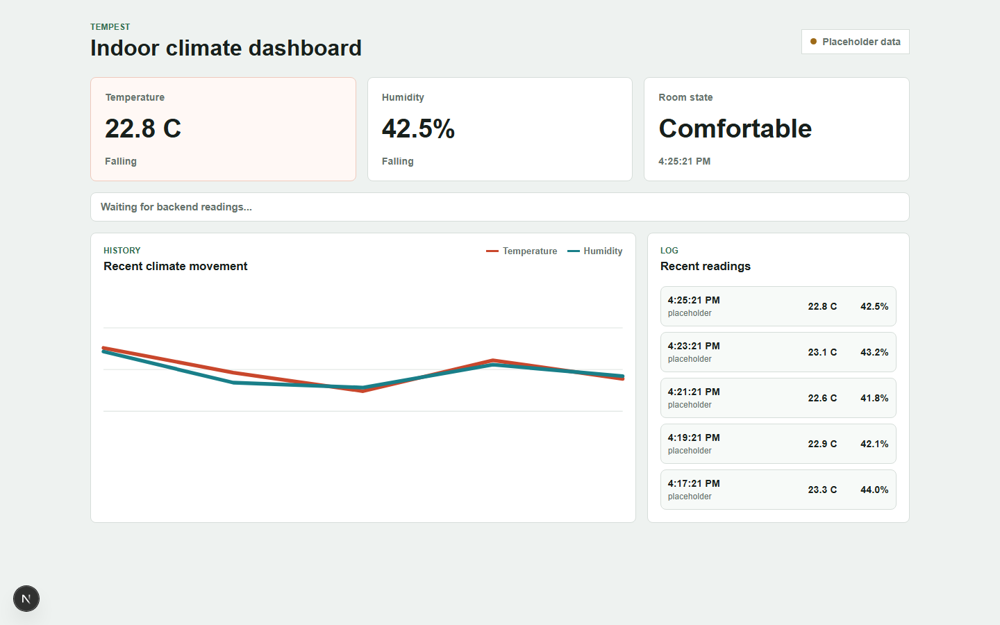

# Tempest

Reliable Indoor Climate Telemetry.



Tempest is an indoor climate monitoring project that connects physical hardware to a backend system and a web dashboard. The project reads temperature and humidity from a sensor, sends that data into software, and organizes it so it can be stored, viewed, and used by other parts of the application.

The hardware side uses an Arduino Uno R3 connected to a DHT11 temperature and humidity sensor and a 16x2 LCD display. The Arduino reads the sensor data, shows the current room conditions on the LCD, and prints the readings over USB Serial.

The backend side is the main software focus of the project. It is where the sensor readings can be received, validated, stored, and served through an API. Through Tempest, I am learning how backend systems work with real-world data instead of only static examples.

The frontend side uses Next.js to display the climate data in a web dashboard. This gives the project a simple full-stack structure: hardware collects the data, the backend processes it, and the frontend shows it to the user.

## Current Goal

The goal of Tempest is to build a full-stack indoor climate telemetry system. The Arduino reads live temperature and humidity from the DHT11 sensor, the computer forwards those readings into a backend API, the backend validates and stores the data, and the dashboard displays current and historical room conditions.

## Hardware

- Arduino Uno R3
- DHT11 temperature and humidity sensor
- 16x2 LCD display
- Breadboard and jumper wires

## Wiring

- DHT11 data -> Arduino D2
- LCD RS -> Arduino D7
- LCD Enable -> Arduino D8
- LCD D4 -> Arduino D3
- LCD D5 -> Arduino D4
- LCD D6 -> Arduino D5
- LCD D7 -> Arduino D6
- LCD RW -> GND

## Software and Skills

- C++ for Arduino firmware
- Arduino framework for reading sensors and controlling hardware
- Python for backend development
- FastAPI for building API endpoints
- Pydantic for validating incoming sensor data
- SQLAlchemy for working with database models
- PostgreSQL for storing temperature and humidity readings
- Docker for running backend services in a consistent environment
- Next.js for building the web dashboard
- React for creating frontend components
- TypeScript for safer frontend code
- REST API design for sending data between the hardware, backend, and dashboard
- Sensor data handling for real temperature and humidity readings
- LCD output for displaying live measurements
- Serial output for sending hardware readings to software
- Git and GitHub for version control and project organization

## Serial to Backend Bridge

The Arduino firmware prints machine-readable sensor lines over USB Serial:

```text
status=ok,temp_c=23.4,humidity=41.0
```

The Python bridge in `tools/serial_forwarder.py` reads those lines and forwards successful readings to the backend API.

Install the backend dependencies:

```powershell
python -m pip install -r backend/requirements.txt
```

Start PostgreSQL:

```powershell
docker compose up -d postgres
```

Start the local backend:

```powershell
python -m uvicorn backend.app.main:app --reload
```

Install the serial bridge dependency:

```powershell
python -m pip install -r tools/requirements.txt
```

Run the bridge, replacing `COM3` with the Arduino port shown by the Arduino IDE:

```powershell
python tools/serial_forwarder.py --port COM3
```

For a quick test without the Arduino connected, run:

```powershell
'status=ok,temp_c=23.4,humidity=41.0' | python tools/serial_forwarder.py --stdin
```

Then check the latest reading:

```powershell
curl http://127.0.0.1:8000/readings/latest
```

The backend stores readings in PostgreSQL using the `DATABASE_URL` value from `.env.example`.

## Web Dashboard

The Next.js dashboard in `frontend/` displays the latest temperature, humidity, comfort state, recent readings, and a simple history chart.

Install the frontend dependencies:

```powershell
cd frontend
npm install
```

Start the dashboard:

```powershell
npm run dev
```

Then open:

```text
http://localhost:3000
```

The dashboard fetches through Next.js API routes, which proxy requests to the FastAPI backend at `TEMPEST_BACKEND_BASE_URL`. If the backend is unavailable or has no readings yet, the dashboard stays usable by showing clearly labeled placeholder readings.

Tempest combines embedded systems, backend development, databases, and basic electronics into one hands-on project.

